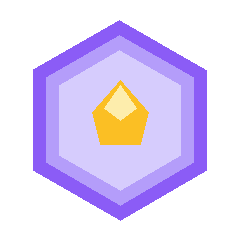
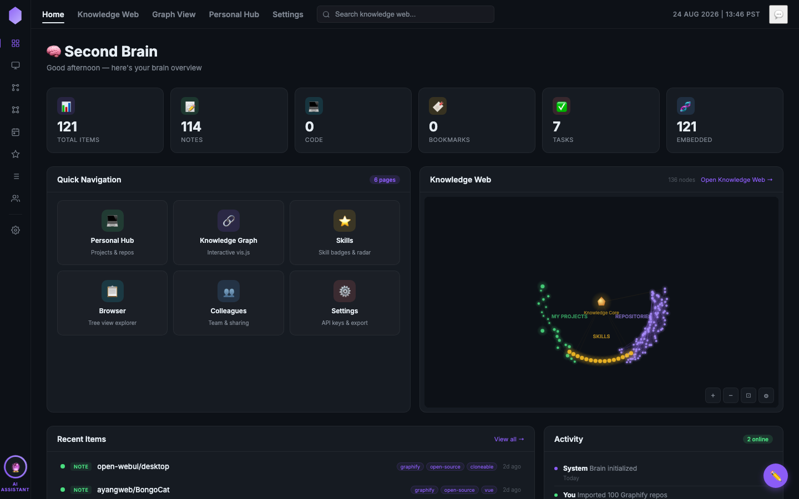
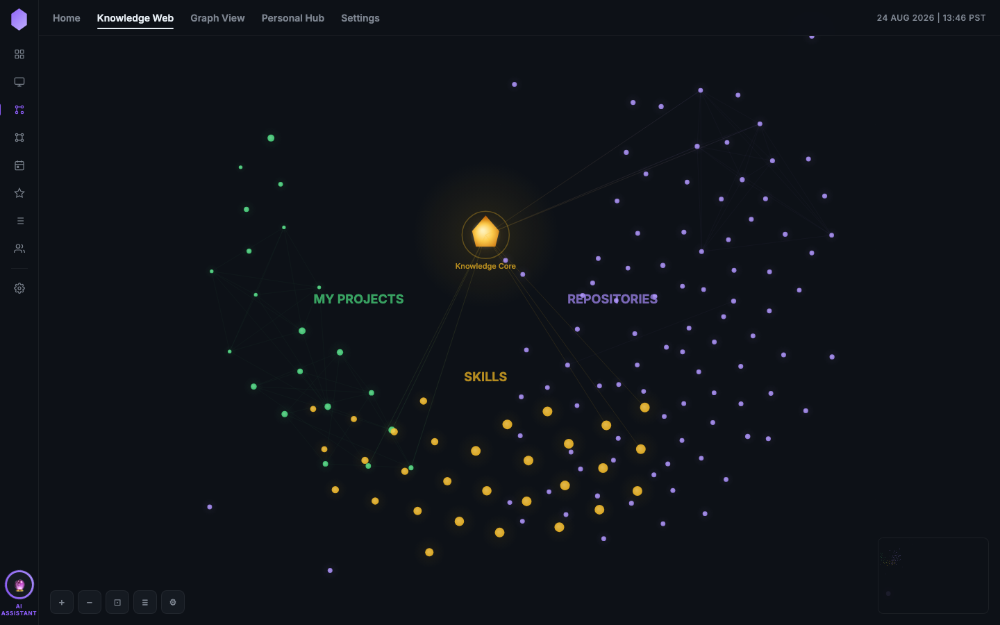
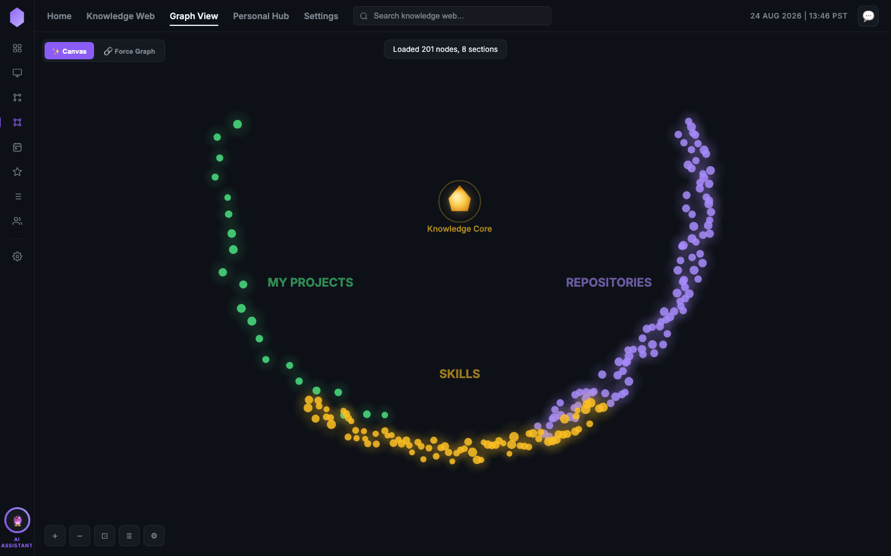
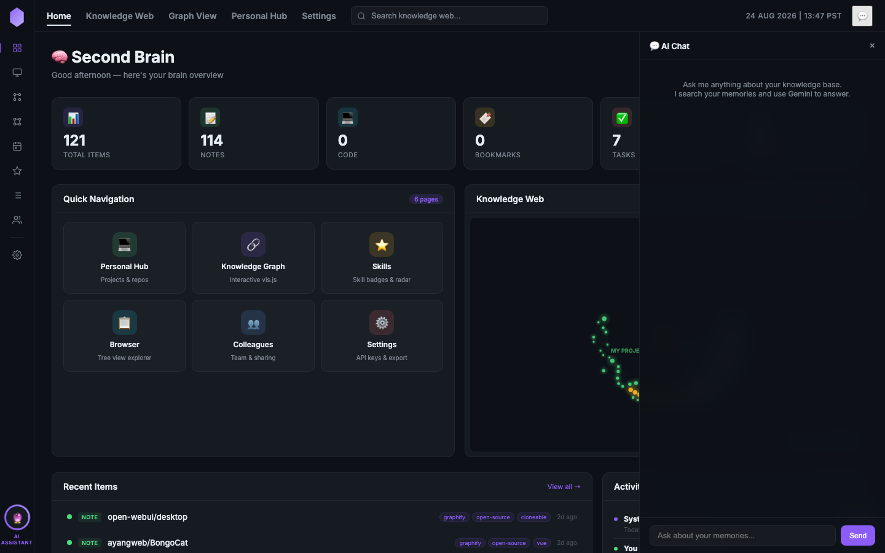
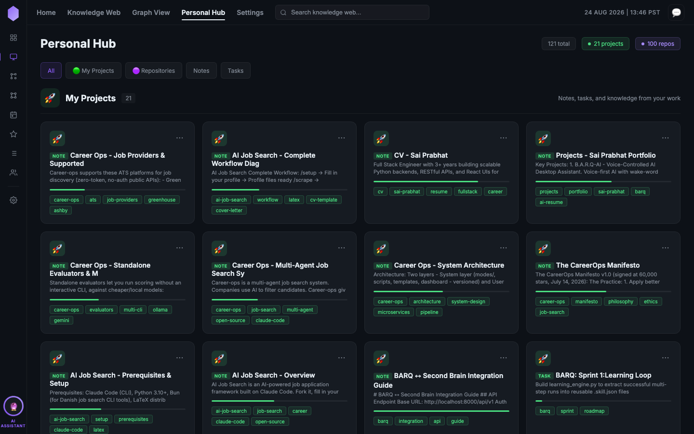
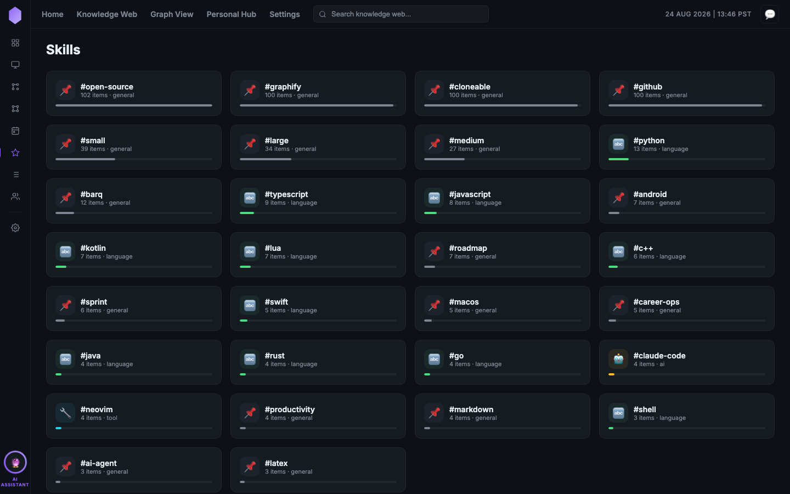
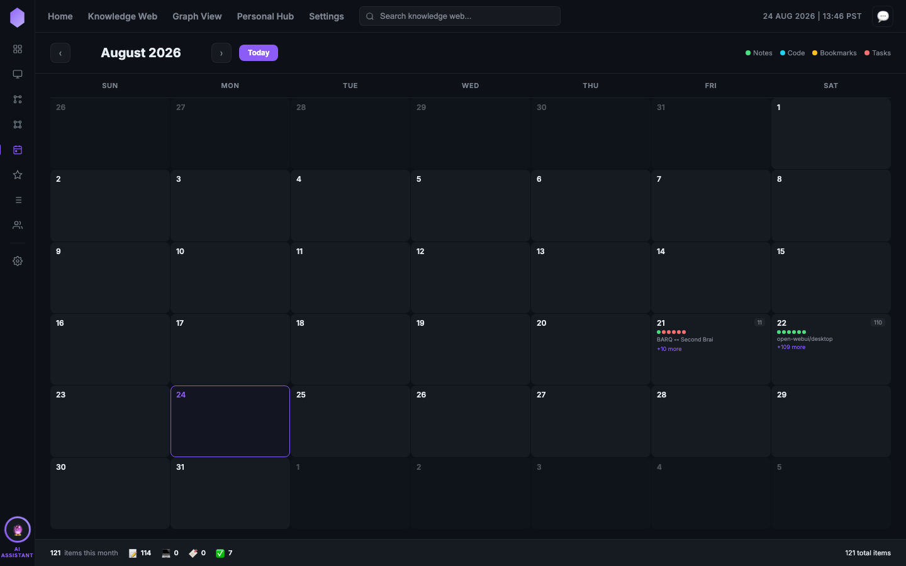

<p align="center">
  
</p>

<h1 align="center">🧠 Second Brain</h1>

<p align="center">
  <strong>AI-powered personal knowledge management system</strong><br>
  Store notes, code, bookmarks & tasks — fully searchable with text + semantic search.<br>
  Built with Flask, SQLite FTS5, sentence-transformers, and Gemini AI.
</p>

<p align="center">
  <a href="#quick-start">Quick Start</a> •
  <a href="#features">Features</a> •
  <a href="#screenshots">Screenshots</a> •
  <a href="#api-reference">API</a> •
  <a href="#architecture">Architecture</a>
</p>

<p align="center">
  
  
  
  
  
</p>

---

## Screenshots

### 📊 Dashboard
<p align="center">
  
</p>

> Overview of your entire knowledge base — stats, recent items, mini knowledge graph, system health, and memory usage.

### 🔗 Knowledge Web
<p align="center">
  
</p>

> Interactive force-directed canvas graph with a golden Knowledge Core at the center. Nodes orbit around three hubs: **My Projects** (green), **Repositories** (purple), and **Skills** (gold). Physics controls, minimap, and zoom/pan built in.

### 🕸️ Graph View
<p align="center">
  
</p>

> Toggle between the canvas graph and a vis.js force-directed layout with 200+ nodes and 1000+ edges. Click any node to see details in the organized right sidebar.

### 💬 AI Chat
<p align="center">
  
</p>

> Gemini-powered chat that searches your knowledge base before answering. Slide-out panel accessible from every page. Chat history persists across sessions.

### 📁 Personal Hub
<p align="center">
  
</p>

> Grid view of all your knowledge items, separated into **My Projects** and **Repositories**. Filter by type, sort by date, and click to view full details.

### ⭐ Skills
<p align="center">
  
</p>

> Skill cloud showing your most-used tags and technologies, with item counts and quick access.

### 📅 Calendar
<p align="center">
  
</p>

> View all items by creation date. Click any day to see what was added.

---

## Features

### 🧠 Knowledge Management
- **4 item types** — Notes, Code snippets, Bookmarks, Tasks
- **Tagging system** — Organize with unlimited custom tags
- **Content previews** — See snippets without opening items
- **Bulk import/export** — JSON and Markdown ZIP formats

### 🔍 Search
- **Full-text search** — SQLite FTS5 for instant keyword matching
- **Semantic search** — `all-MiniLM-L6-v2` embeddings understand meaning, not just keywords
- **Hybrid search** — Combines both for the best results
- **100% local** — No API keys needed for search, runs on CPU

### 📊 Knowledge Graph
- **Force-directed canvas graph** — Custom physics simulation with orbital animation
- **vis.js integration** — Interactive force graph with clustering
- **3 hub layout** — My Projects (green), Repositories (purple), Skills (gold)
- **Golden Knowledge Core** — Central node connecting everything
- **Minimap** — Overview of the entire graph
- **Physics controls** — Adjust rotation speed, node spread, and glow intensity
- **Zoom, pan & drag** — Mouse wheel zoom, click-drag pan, node drag

### 🤖 AI Integration
- **Gemini AI chat** — Ask questions about your knowledge base
- **Context-aware** — Searches your memories before answering
- **Persistent history** — Chat history saved across sessions
- **Auto-tagging** — AI suggests tags and categories

### 🌐 9 Interconnected Pages

| Page | Route | Description |
|------|-------|-------------|
| **Dashboard** | `/` | Stats overview, mini graph, system health, memory chart |
| **Knowledge Web** | `/knowledge` | Full-screen canvas graph with physics |
| **Graph View** | `/graph` | Toggle between canvas + vis.js graphs |
| **Personal Hub** | `/hub` | Grid view of all items (projects + repos) |
| **Skills** | `/skills` | Tag cloud and skill analytics |
| **Calendar** | `/calendar` | Items by creation date |
| **Browser** | `/browser` | Tree view with full-text search |
| **Colleagues** | `/colleagues` | Sharing and collaboration |
| **Settings** | `/settings` | API keys, export/import, system config |

### 🔐 Security
- **API key authentication** — All endpoints protected
- **No cloud dependency** — Your data never leaves your machine
- **SQLite** — Single file database, easy to backup

---

## Quick Start

### Prerequisites
- Python 3.10+
- pip

### Installation

```bash
# Clone the repository
git clone https://github.com/venom20021/second-brain.git
cd second-brain

# Create virtual environment
python3 -m venv .venv
source .venv/bin/activate   # On Windows: .venv\Scripts\activate

# Install dependencies
pip install -r requirements.txt

# Run the server
python app/main.py
```

Open **http://localhost:8000** in your browser.

> First run downloads the embedding model (~80MB), then everything runs offline.

### Generate API Key

On first launch, generate your API key:

```bash
curl -X POST http://localhost:8000/api/v1/setup \
  -H "Content-Type: application/json" \
  -d '{"name": "default"}'
```

Enter this key in the web UI when prompted.

---

## Tech Stack

| Layer | Technology |
|-------|-----------|
| **Backend** | Python, Flask |
| **Database** | SQLite + FTS5 |
| **Embeddings** | sentence-transformers (`all-MiniLM-L6-v2`, 384-dim) |
| **AI Chat** | Google Gemini API |
| **Frontend** | Vanilla HTML/CSS/JS (no build step) |
| **Graph** | HTML5 Canvas + vis.js |
| **Realtime** | Socket.IO (WebSocket) |

---

## API Reference

Base URL: `http://localhost:8000/api/v1`

### Items

| Method | Endpoint | Description |
|--------|----------|-------------|
| `POST` | `/items` | Create an item |
| `GET` | `/items` | List all items (supports `?limit`, `?item_type`, `?tag`) |
| `GET` | `/items/:id` | Get one item |
| `PUT` | `/items/:id` | Update an item |
| `DELETE` | `/items/:id` | Delete an item |

### Search

| Method | Endpoint | Description |
|--------|----------|-------------|
| `POST` | `/search` | Search (`mode`: text / semantic / hybrid) |

```bash
# Semantic search — understands meaning
curl -X POST http://localhost:8000/api/v1/search \
  -H "X-API-Key: sb_your_key" \
  -H "Content-Type: application/json" \
  -d '{"query": "things about performance optimization", "mode": "semantic"}'
```

### AI Chat

| Method | Endpoint | Description |
|--------|----------|-------------|
| `POST` | `/chat` | Chat with Gemini (searches brain first) |

```bash
curl -X POST http://localhost:8000/api/v1/chat \
  -H "X-API-Key: sb_your_key" \
  -H "Content-Type: application/json" \
  -d '{"message": "What do I know about Flask?", "history": []}'
```

### Authentication

| Method | Endpoint | Description |
|--------|----------|-------------|
| `POST` | `/setup` | Generate first API key (one-time) |
| `GET` | `/auth/keys` | List all API keys |
| `POST` | `/auth/keys` | Create a new API key |
| `DELETE` | `/auth/keys/:id` | Revoke an API key |
| `GET` | `/auth/status` | Check auth status |

### Import / Export

| Method | Endpoint | Description |
|--------|----------|-------------|
| `GET` | `/export` | Export all items as JSON |
| `GET` | `/export/markdown` | Export as ZIP of markdown files |
| `POST` | `/import` | Bulk import from JSON |
| `POST` | `/import/markdown` | Import from markdown ZIP |

### Utilities

| Method | Endpoint | Description |
|--------|----------|-------------|
| `GET` | `/stats` | Brain statistics |
| `GET` | `/graph` | Graph data (nodes, edges, sections) |
| `GET` | `/system` | System health info |
| `POST` | `/reindex` | Re-embed all items |

---

## Architecture

```
second-brain/
├── app/
│   ├── main.py              # Flask app + routes + WebSocket
│   ├── database.py          # SQLite + FTS5 + auth layer
│   ├── embeddings.py        # sentence-transformers (384-dim)
│   └── routes.py            # REST API endpoints
├── static/
│   ├── index.html           # Dashboard
│   ├── knowledge.html       # Knowledge Web (canvas graph)
│   ├── graph.html           # Graph View (canvas + vis.js)
│   ├── hub.html             # Personal Hub
│   ├── skills.html          # Skills
│   ├── calendar.html        # Calendar
│   ├── browser.html         # Browser
│   ├── colleagues.html      # Colleagues
│   ├── settings.html        # Settings
│   └── vendor/              # Local Socket.IO client
├── design-system/           # UI/UX design tokens
├── requirements.txt         # flask, numpy, transformers, torch
├── .env.example             # Environment template
├── brain.db                 # SQLite database (auto-created)
└── README.md
```

### Data Flow

```
User Input → Flask API → SQLite FTS5 (text search)
                       → sentence-transformers (embeddings)
                       → SQLite vec (vector search)
                       → Gemini API (AI chat)
                       → HTML5 Canvas (graph visualization)
```

---

## Integration

The REST API is designed for easy integration with other projects.

### Python

```python
import requests

API = "http://localhost:8000/api/v1"
HEADERS = {"X-API-Key": "sb_your_key", "Content-Type": "application/json"}

# Create a note
requests.post(f"{API}/items", headers=HEADERS, json={
    "item_type": "note",
    "title": "From BARQ",
    "content": "Some knowledge from the BARQ project",
    "tags": ["barq", "integration"]
})

# Semantic search
results = requests.post(f"{API}/search", headers=HEADERS, json={
    "query": "BARQ project",
    "mode": "hybrid"
}).json()
```

### JavaScript

```javascript
const API = "http://localhost:8000/api/v1";
const headers = {"X-API-Key": "sb_your_key", "Content-Type": "application/json"};

// Create
await fetch(`${API}/items`, {
  method: "POST", headers,
  body: JSON.stringify({item_type: "note", title: "Hello", content: "World"})
});

// Search
const results = await fetch(`${API}/search`, {
  method: "POST", headers,
  body: JSON.stringify({query: "hello", mode: "semantic"})
}).then(r => r.json());
```

### cURL

```bash
# Create an item
curl -X POST http://localhost:8000/api/v1/items \
  -H "X-API-Key: sb_your_key" \
  -H "Content-Type: application/json" \
  -d '{"item_type":"note","title":"My note","content":"Hello!","tags":["getting-started"]}'

# Export everything
curl -H "X-API-Key: sb_your_key" http://localhost:8000/api/v1/export -o brain-export.json
```

---

## Environment Variables

| Variable | Default | Description |
|----------|---------|-------------|
| `BRAIN_DB_PATH` | `brain.db` | SQLite database path |

---

## License

MIT License — do whatever you want with it.

---

<p align="center">
  Built with 💜 by <a href="https://github.com/venom20021">venom20021</a>
</p>
